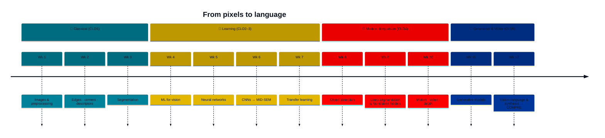

<div align="center">


### 🎓 BITS Pilani, Dubai Campus · First Semester 2026-27


**Instructor-in-charge:** Prof. Elakkiya R

[🚀 Get set up](#-get-set-up-in-3-minutes) · [🗓️ Schedule](#️-the-12-week-journey) · [🏆 Grading](#-how-you-earn-marks) · [🧪 Mini project](#-mini-project) · [🌐 Live demos](#-live-demos) · [📚 Books](#-textbooks-all-free)

</div>

---

## ✨ What this course is

> **You don't learn vision by watching it. You learn it by building it.**

Every week, you write the algorithm of the week **yourself** — raw NumPy in September, fine-tuned foundation models by December — and verify it against a reference *before you leave the room*. Lectures give you the ideas. The lab is where they become yours.

In Week 1 you build your own Instagram from scratch. By Week 12 you'll understand exactly how **SAM**, **CLIP** and **Stable Diffusion** work under the hood — and you'll have fine-tuned one of them.

```
  🖼️ pixels  →  🔍 features  →  ✂️ segments  →  🧠 networks  →  🎯 detection  →  🎬 motion & depth  →  🎨 generation  →  💬 vision + language
```

---

## 🗓️ The 12-week journey



| Wk | 🎯 Topic | 🧪 Lab | 📖 Read |
|:--:|---------|--------|---------|
| 1 | 🖼️ Images & preprocessing | [`lab01` · Filter Studio](labs/lab01) | T2 Ch.3 · R1 Ch.1 |
| 2 | 🔍 Feature extraction — edges, corners, descriptors | `lab02` | T2 Ch.7 |
| 3 | ✂️ Segmentation — thresholding, clustering, morphology | `lab03` | T2 Ch.3, 7 |
| 4 | 📈 Machine learning for vision | `lab04` | T1 Ch.2, 5–6 |
| 5 | 🧠 Neural networks | `lab05` | T1 Ch.3–4, 7 |
| 6 | 🧩 Convolutional neural networks | `lab06` | T1 Ch.10 · R1 Ch.3–5 |
| 🛑 | **MID-SEM · 22 Oct 2026 (AN) · closed book · Weeks 1–6** | | |
| 7 | 🔁 Transfer learning | `lab07` | R1 Ch.6 · T1 Ch.9 |
| 8 | 🎯 Object detection | `lab08` | R1 Ch.7 · T2 Ch.6 |
| 9 | 🗺️ Deep segmentation & foundation models | `lab09` | T2 Ch.6 · R2 |
| 10 | 🎬 Motion, video & depth | `lab10` | T2 Ch.9, 12 |
| 11 | 🎨 Generative models | `lab11` | T1 Ch.15, 17–18 |
| 12 | 💬 Vision–language models & synthesis | `lab12` | T1 Ch.12 · R2 |
| 🏁 | **COMPRE · 18 Dec 2026 (AN) · closed book** | | |

> 📦 Lab folders drop the **morning of each session**. Watch this repo (👁️ *Watch → All activity*) so you never miss one.

---

## 🏆 How you earn marks

<table>
<tr>
<td align="center" width="20%"><h3>🧪 20%</h3><b>EC1 · Labs</b><br/><sub>weekly · individual · in-session</sub></td>
<td align="center" width="20%"><h3>📝 10%</h3><b>EC2 · Mini project I</b><br/><sub>problem + literature review<br/>before mid-sem</sub></td>
<td align="center" width="20%"><h3>📄 20%</h3><b>EC3 · Mid-sem</b><br/><sub>22.10.2026 AN<br/>closed book · Wk 1–6</sub></td>
<td align="center" width="20%"><h3>🚀 20%</h3><b>EC4 · Mini project II</b><br/><sub>code + demo + paper<br/>ICCV/ECCV format</sub></td>
<td align="center" width="20%"><h3>🎓 30%</h3><b>EC5 · Compre</b><br/><sub>18.12.2026 AN<br/>closed book</sub></td>
</tr>
</table>

### 🧪 Labs — the weekly hackathon

Each lab is a **two-hour build**, marked out of 10, *in the room, on the day*:

| | Marks | What it is |
|--|:--:|--|
| ✅ **Verify** | 4 | Numerical questions seeded from **your** student ID — nobody has the same numbers |
| 🔨 **Task** | 4 | Implementation on real data, checked against a reference |
| ⚡ **Stretch** | 2 | Go beyond. Surprise us. |

🔥 Marks are awarded **only during the session**, through demonstration and viva. Miss the session and that week is capped at **50% of the marks** — so show up, and show up ready. Your standing shows on the **class leaderboard** under the alias you pick in Week 1.

---

## 🧪 Mini project

👥 **Teams of two.** Topics come from the **second half** of the course only — detection · segmentation · motion & depth · generative · vision–language — and are released in [`mini-project/`](mini-project).

| Milestone | Weight | You deliver | When |
|-----------|:------:|-------------|------|
| 📝 Term-I | 10% | Problem statement + literature review | before mid-sem *(TBA)* |
| 🚀 Term-II | 20% | Working code + live demo + paper in **ICCV/ECCV format** | *(TBA)* |

---

## 🚀 Get set up in 3 minutes

```bash
git clone https://github.com/Elakkiya16/BITS_F459_Computer_Vision_26_27.git
cd BITS_F459_Computer_Vision_26_27
pip install -r setup/requirements.txt
python setup/verify_setup.py        # → must print  ALL OK
```

> ⚠️ Do this **before Week 1**. There is no time in the session to fix an environment.

<details>
<summary>📁 <b>Repository layout</b> — click to expand</summary>

```
📦 BITS_F459_Computer_Vision_26_27
 ┣ 📂 setup/          requirements + environment check
 ┣ 📂 labs/
 ┃  ┣ 📂 lab01/       notebook + TASKS.md   (published on the day)
 ┃  ┗ 📂 lab02/ …
 ┣ 📂 mini-project/   topics · milestones · paper template
 ┣ 📂 leaderboard/    how the class leaderboard works
 ┗ 📂 docs/           browser demos  →  GitHub Pages
```
</details>

<details>
<summary>📤 <b>Submitting lab work</b></summary>

Labs are distributed and collected through **GitHub Classroom**; the join link is shared in the Week 1 session. Commit your notebook to your classroom repo **before the session ends** — the timestamp of your last commit is what counts.
</details>

---

## 🌐 Live demos

Browser demos for the labs run at **https://elakkiya16.github.io/BITS_F459_Computer_Vision_26_27/** — no install, works on your phone. 📱

---

## 📚 Textbooks (all free)

| | Book | Link |
|--|------|------|
| **T1** | Prince — *Understanding Deep Learning* | [udlbook.github.io](https://udlbook.github.io/udlbook/) |
| **T2** | Szeliski — *Computer Vision: Algorithms and Applications*, 2nd ed. | [szeliski.org/Book](https://szeliski.org/Book/) |
| **R1** | Elgendy — *Deep Learning for Vision Systems* | — |
| **R2** | Stanford **CS231n** course notes | [cs231n.github.io](https://cs231n.github.io/) |
| **R3** | Recent CVPR / ICCV / ECCV papers | linked per week |

---

<div align="center">

**Questions?** Open an [Issue](../../issues) · or bring them to the chamber consultation hour.

Made with 🩵 for the Class of 2026-27 · *Build it. Verify it. Ship it.*


</div>
